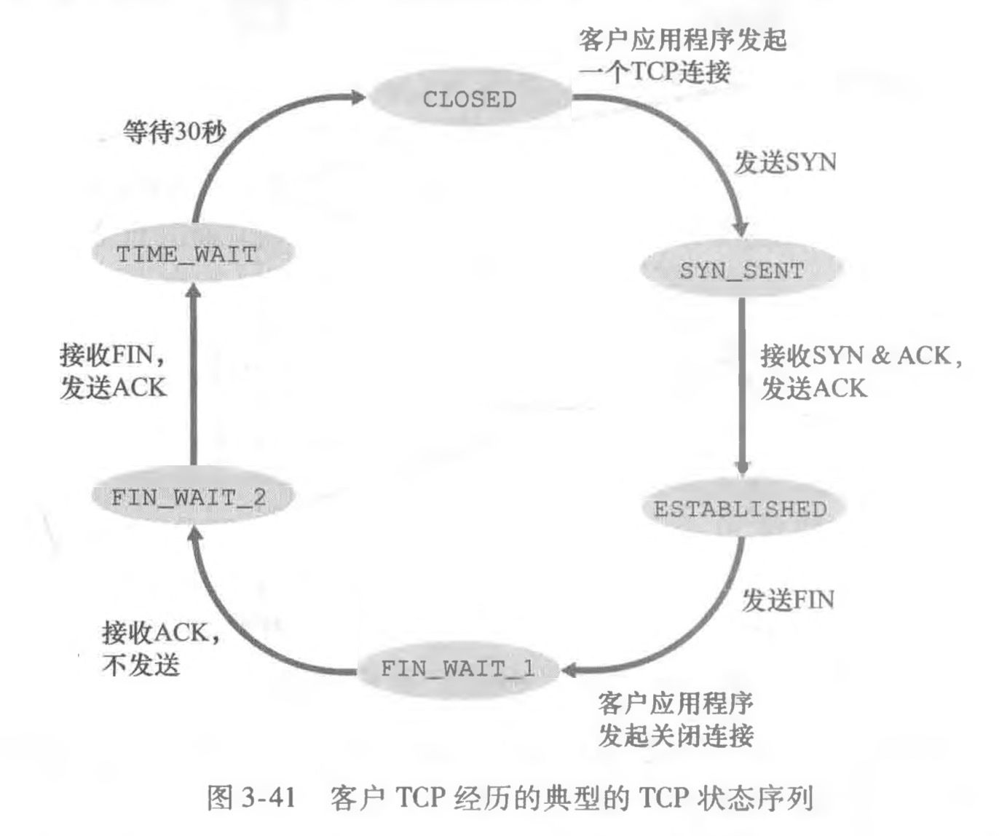
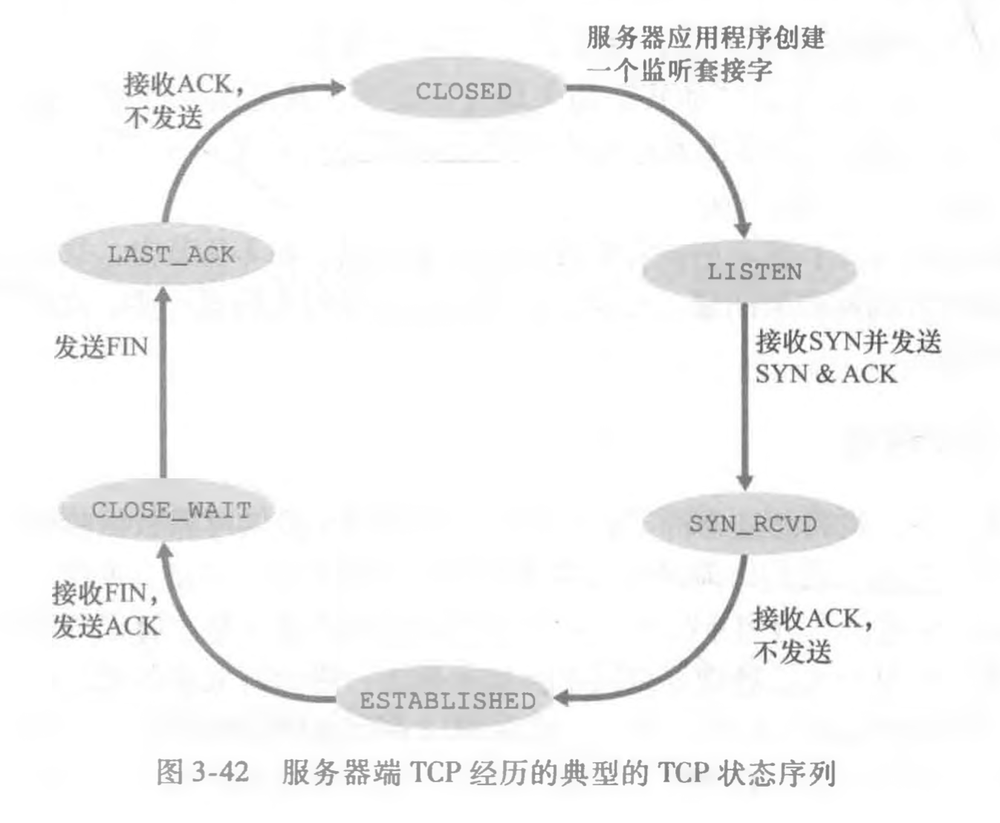

### TCP Reno实现方式
#### 相关宏定义
```C
// packet lengths
#define MAX_LEN 1400

// payload_len <= MSS
#define MSS (MAX_LEN - sizeof(cmu_tcp_header_t))

// window variables
#define WINDOW_INITIAL_WINDOW_SIZE (MSS * 16)
#define WINDOW_INITIAL_RTT 3000  // ms

// Max TCP Buffer
#define MAX_NETWORK_BUFFER 65535
```

#### 连接管理
1. **三次握手建立连接**
- 客户端发送SYN报文，随机初始化seq，记为``client_isn``放在报文的seq字段中。
- 服务端收到SYN报文，发送SYNACK报文，ACK编号为``client_isn+1``。服务端随机初始化自己的seq，记为``server_isn``，放在报文的seq字段中。服务端为连接分配缓存和变量。
- 客户端收到SYNACK报文后，为连接分配缓存和变量，可开始传输数据，之后所有报文的SYN标记都为0。第一次传输时，seq为``client_isn+1``，ACK编号为``server_isn+1``。若第一次传输的是纯粹的不带数据的ACK，则服务端不应响应。
- 若中途丢包，需要超时重传。
2. **四次挥手结束连接**
- 客户端发送FIN报文，服务端进行确认。
- 服务端发送FIN报文，客户端进行确认。
- 若中途丢包，也需要超时重传。
- 客户端发送ACK后，需要等待30s（防止ACK丢失，服务端重传时客户端关闭）再释放资源。服务端收到ACK后释放资源。
3. 典型的客户端和服务端TCP状态变化图



#### RTT估计
1. **SampleRTT**：没有重传过的报文从发出到收到对应ACK的时间间隔。
2. **指数加权移动平均**：每次获取新的SampleRTT后，设置 $EstimatedRTT = (1 - \alpha) \times EstimatedRTT + \alpha \times SampleRTT$，推荐值 $\alpha = 0.125$。
3. RTT偏差**DevRTT**：$DevRTT = (1 - \beta) \times DevRTT + \beta \times \vert SampleRTT - EstimatedRTT \vert$，推荐值 $\beta = 0.25$。
4. 重传超时间隔**TimeoutInterval**：初始值1s。
- 收到上层应用数据或收到ACK后，$TimeoutInterval = EstimatedRTT + 4 \times DevRTT$。
- 超时后，加倍。
- 应该可以不作为全局变量，而是放在函数内计算。
5. 快速重传：连续收到3个冗余ACK，视为之后的报文全部NAK，在超时之前触发重传。

#### 可靠数据传输
1. ACK生成策略
    | 事件 | 接收方行为 |
    | --- | --- |
    | 具有所期望序号的按序报文到达，之前的报文都已确认 | 延迟ACK：等待最多500ms，若下一个按序保文段没有到达则发送ACK |
    | 具有所期望序号的按序报文到达，但有另一个按序保文段未发送ACK（等待中） | 立即发送一个累计确认的ACK，确认两个报文 |
    | 比所期望序号大的失序报文到达 | 接受这个报文并立即发送冗余ACK，指示间隔低端 |
    | 能部分或完全填充间隔的报文到达 | 若该报文起始于间隔低端，则立即发送ACK |
- 这种策略允许接收方接受失序报文，但发送方依然会将失序报文重发。
- 我们可以放弃失序报文，收到失序报文就立即发送冗余ACK，不作额外处理。
2. 滑动窗口（GBN）
- 因为我们的TCP header比较简单，所以可以不支持选择确认，采用回退N步即可。
- 回退N步的实现方式见中文课本P145-148。

#### 流量控制和拥塞控制
1. checkpoint 2不需要实现，窗口大小固定为``WINDOW_INITIAL_WINDOW_SIZE``。
2. 接收方收到报文，若接收缓存装不下，就装没看见。
